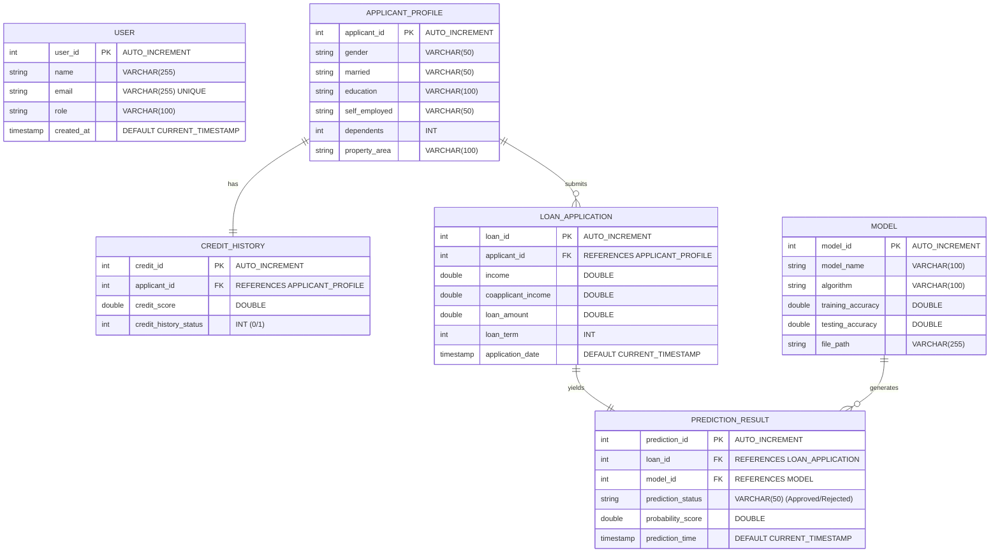

# 🏦 Smart Lender: Machine Learning Loan Approval Prediction System

[](https://smart-lender-dple.onrender.com)
[](https://www.python.org/)
[](https://flask.palletsprojects.com/)
[](https://www.mysql.com/)
[](https://scikit-learn.org/)
[](https://xgboost.readthedocs.io/)
[](https://github.com/scikit-learn-contrib/imbalanced-learn)

Smart Lender is an end-to-end Machine Learning web application designed to predict loan approval decisions. The platform leverages a state-of-the-art **XGBoost Classifier** model to assess loan applications based on applicant demographic details, credit history, and financial indicators.

🌐 **Live Application URL:** [https://smart-lender-dple.onrender.com](https://smart-lender-dple.onrender.com)

The application features a modern Flask web interface, a robust and normalized MySQL database backend matching 3NF design principles, and an automated data preprocessing pipeline.

---

## 🏗️ System Architecture

The project is structured to separate concern between model training, exploratory analysis, database storage, and the web interface.

```
┌────────────────────────┐      ┌────────────────────────┐      ┌────────────────────────┐
│   Data Preprocessing   │ ───> │     Model Training     │ ───> │     Saved Artifacts    │
│  - IQR Outlier Impute  │      │  - Decision Tree, KNN  │      │  - scale1.pkl (Scaler) │
│  - SMOTE Class Balance │      │  - RF & Gradient Boost │      │  - rdf.pkl (XGBoost)   │
└────────────────────────┘      │  - XGBoost (Best)      │      └────────────────────────┘
                                └────────────────────────┘                  │
                                                                            ▼
┌────────────────────────┐      ┌────────────────────────┐      ┌────────────────────────┐
│     MySQL Database     │ <─── │   Flask Web Interface  │ <─── │   Real-time Predict    │
│ - Normalized DB tables │      │ - / (Home & Dashboard) │      │ - Preprocessing        │
│ - Tracks Predictions   │      │ - /submit (Form page)  │      │ - Scaling Features     │
└────────────────────────┘      └────────────────────────┘      └────────────────────────┘
```

The system architecture and process flows are documented in the root image: [smart_lender architecture.png](file:///c:/Users/dvndr/Downloads/skill%20wallet%20project%20docs/smart_lender%20architecture.png).

---

## 📊 Machine Learning Pipeline & Statistics

The predictive intelligence of **Smart Lender** is built upon a structured ML pipeline, starting from raw data analysis to model deployment.

### 1. Dataset Overview
The model uses the [loan_prediction.csv](file:///c:/Users/dvndr/Downloads/skill%20wallet%20project%20docs/Dataset/loan_prediction.csv) dataset located in the [Dataset](file:///c:/Users/dvndr/Downloads/skill%20wallet%20project%20docs/Dataset) directory, containing **614 records** with the following features:

*   **Demographics:** `Gender`, `Married`, `Dependents`, `Education`, `Self_Employed`
*   **Financials:** `ApplicantIncome` (Applicant's Income), `CoapplicantIncome` (Co-applicant's Income), `LoanAmount` (Loan amount in thousands), `Loan_Amount_Term` (Term of loan in days)
*   **Credit & Location:** `Credit_History` (1.0 = Good, 0.0 = Bad), `Property_Area` (Urban, Semiurban, Rural)
*   **Target Class:** `Loan_Status` (Y = Approved, N = Rejected)

Exploratory Data Analysis (EDA) is performed in [visualization.ipynb](file:///c:/Users/dvndr/Downloads/skill%20wallet%20project%20docs/visualization_analisys/visualization.ipynb) containing correlation heatmaps, boxplots for outlier discovery, and histograms of income and credit profiles.

### 2. Preprocessing & Data Wrangling
Steps taken during preprocessing inside [preprocessing.ipynb](file:///c:/Users/dvndr/Downloads/skill%20wallet%20project%20docs/data_preprocessing/preprocessing.ipynb):
*   **Categorical Encoding:** Features are mapped to numerical scales (e.g., `Graduate`: 1, `Not Graduate`: 0; `Urban`: 2, `Semiurban`: 1, `Rural`: 0).
*   **Imputation of Missing Values:** Missing values are imputed using the mode value for each feature.
*   **Outlier Treatment:** Outliers in `ApplicantIncome`, `CoapplicantIncome`, and `LoanAmount` are handled using the Interquartile Range (IQR) method.
*   **Feature Scaling:** Features are standardized using `StandardScaler` to ensure scale invariance across distance-based algorithms.
*   **Class Imbalance Mitigation:** The dataset originally had an imbalanced target distribution of **422 Approved (Y) : 192 Rejected (N)**. We applied **SMOTE (Synthetic Minority Over-sampling Technique)** to balance the dataset to **422 Approved : 422 Rejected**, avoiding model bias toward approvals.

### 3. Model Training & Comparison
Various algorithms were trained and evaluated using a $67\%$-$33\%$ Train-Test split. Cross-validation (5-fold) was performed to ensure generalizability.

| Machine Learning Model | Test Accuracy | 5-Fold CV Mean Accuracy | Description |
| :--- | :---: | :---: | :--- |
| **Decision Tree** | 78.70% | 81.30% | Deep tree constrained to max depth 5 to avoid overfitting. |
| **KNN (K-Nearest Neighbors)** | 78.11% | 78.40% | Grouping based on 5 neighbors using Euclidean metrics. |
| **Random Forest** | 84.02% | 84.80% | Ensemble of 100 decision trees built on balanced data. |
| **Gradient Boosting** | 84.02% | 85.10% | Iterative boosting of trees with low residuals. |
| **XGBoost (XGBClassifier)** | **84.94%** | **85.34%** | **Optimal model selected due to high test accuracy and low variance.** |

> [!NOTE]
> The final model saved in [Flask/rdf.pkl](file:///c:/Users/dvndr/Downloads/skill%20wallet%20project%20docs/Flask/rdf.pkl) contains the trained `XGBClassifier` (saving under the filename `rdf.pkl` for backward compatibility with the legacy application shell). The corresponding scaler is saved as [Flask/scale1.pkl](file:///c:/Users/dvndr/Downloads/skill%20wallet%20project%20docs/Flask/scale1.pkl).

---

## 🗄️ Database Design & ERD

Smart Lender implements a relational MySQL database structure matching the Entity-Relationship Diagram layout in [smart_lender_erd.png](file:///c:/Users/dvndr/Downloads/skill%20wallet%20project%20docs/entity%20relationship%20diagram/smart_lender_erd.png). The SQL script is stored in [Flask/schema.sql](file:///c:/Users/dvndr/Downloads/skill%20wallet%20project%20docs/Flask/schema.sql).

### Relational Schema (Mermaid Visualization)


---

## 💻 Web Application Flow

The Flask application is implemented inside [Flask/app1.py](file:///c:/Users/dvndr/Downloads/skill%20wallet%20project%20docs/Flask/app1.py). It manages the following routes and features:

1.  **Dashboard & History (`/`):** Reads records from the database using structured `JOIN` queries across the applicant, loan, credit, and prediction tables. Shows the probability scores and statuses in a neat interactive layout.
2.  **Submit Form (`/submit`):** Collects data like demographics, income details, loan request, and credit record.
3.  **Real-Time Inference (`/predict`):** 
    *   Reads the form parameters.
    *   Encodes and scales inputs using the StandardScaler binary.
    *   Performs inference with the XGBoost model binary to yield a prediction class (1 = Approved, 0 = Rejected) and an approval probability.
    *   Inserts the transaction record across MySQL tables and displays results to the user.

---

## 🚀 Setup & Execution Guide

Follow these steps to run the Smart Lender application on your local machine:

### Prerequisites
*   **Python 3.8 - 3.12**
*   **MySQL Server (v8.0 or newer)**

### Step 1: Virtual Environment & Packages
First, set up a virtual environment and install the required libraries:
```powershell
# Create virtual environment
python -m venv .venv

# Activate virtual environment (Windows Powershell)
.venv\Scripts\Activate.ps1

# Install requirements
pip install -r requirements.txt
```

### Step 2: Database Initialization
1.  Log in to your local MySQL terminal and create the target database:
    ```sql
    CREATE DATABASE IF NOT EXISTS smart_lender;
    ```
2.  Import the database schema:
    ```powershell
    mysql -u root -p smart_lender < Flask/schema.sql
    ```
    *Alternatively, the Flask script will automatically create the database structure on startup if it has valid admin credentials.*

### Step 3: Environment Setup
Create a `.env` file in the root directory (using [.env.example](file:///c:/Users/dvndr/Downloads/skill%20wallet%20project%20docs/.env.example) as reference) and define your connection details:
```ini
DB_HOST=127.0.0.1
DB_PORT=3306
DB_USER=root
DB_PASSWORD=your_mysql_password
DB_NAME=smart_lender
```

### Step 4: Run Flask App
To start the Flask development server, execute:
```powershell
python Flask/app1.py
```
The application will run locally and become available at `http://127.0.0.1:5000/`.

---

## 📂 Project Structure

```
├── 1. Brainstorming & Ideation/          # Customer problem exploration & analysis
├── 2. Requirement Analysis/              # User persona and journey maps
├── Dataset/
│   ├── loan_prediction.csv              # Raw CSV data containing 614 rows
│   └── loan_prediction.xlsx             # Spreadsheet data file
├── Flask/
│   ├── templates/
│   │   ├── index.html                   # Dashboard showing history and past requests
│   │   ├── submit.html                  # Input form for applicant registration
│   │   └── predict.html                 # Inference result display
│   ├── app1.py                          # Flask backend orchestration & routing script
│   ├── scale1.pkl                       # Pickled StandardScaler binary
│   ├── rdf.pkl                          # Pickled XGBoost model binary
│   └── schema.sql                       # Database design DDL commands
├── data_preprocessing/
│   └── preprocessing.ipynb              # Model building, pipeline creation, and serialization
├── entity relationship diagram/
│   └── smart_lender_erd.png             # Database ER Diagram
├── visualization_analisys/
│   └── visualization.ipynb              # Exploratory Data Analysis & Plots
├── requirements.txt                     # Project dependencies list
├── .env.example                         # Environment configuration template
└── README.md                            # Main project documentation (this file)
```

---

## 🎨 Design & Aesthetic Notes
The user interface templates utilize standard design aesthetics with a premium look, implementing:
*   **Vibrant Color Palette:** Deep backgrounds paired with clean accent labels (green for approved, red for rejected).
*   **Interactive Components:** Form validations and responsive layout elements.
*   **Comprehensive Logging:** Visual indicators displaying probability percentages (e.g. `84.9% Approved`).
